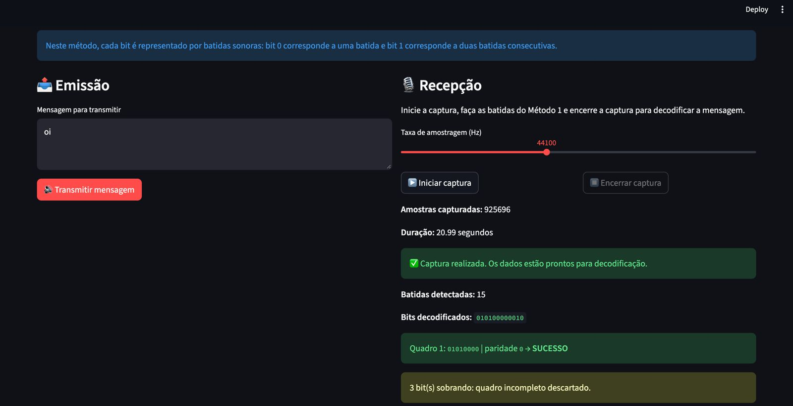
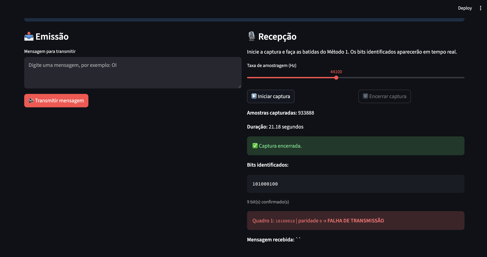

# Projeto Camada Física

Este projeto explora a transmissão e a recepção de dados por ondas sonoras, utilizando dois métodos: comunicação por batidas e modulação 2-FSK. O relatório apresenta os conceitos envolvidos, a implementação e as experiências da equipe nos testes.

## 1. Fundamentação Teórica

### Modelo ISO/OSI

O modelo OSI (Open Systems Interconnection), padronizado pela ISO, organiza a comunicação em redes em sete camadas. Cada uma possui funções específicas e oferece serviços à camada acima dela.

| Camada | Função principal |
| --- | --- |
| 7. Aplicação | Oferece serviços às aplicações, como acesso à web, e-mail e transferência de arquivos. |
| 6. Apresentação | Trata a representação dos dados, incluindo conversão de formatos, compressão e criptografia. |
| 5. Sessão | Estabelece, gerencia e encerra sessões, coordenando o diálogo e pontos de sincronização. |
| 4. Transporte | Realiza a comunicação entre processos, podendo oferecer segmentação, controle de fluxo e recuperação de erros. |
| 3. Rede | Realiza o endereçamento lógico e o encaminhamento de pacotes entre redes. |
| 2. Enlace de Dados | Organiza os dados em quadros e trata o acesso ao meio e a detecção de erros no enlace. |
| 1. Física | Transmite bits pelo meio físico, representando-os por sinais elétricos, ópticos ou acústicos. |

O foco do projeto é a Camada Física. A paridade e o CRC complementam a solução com a verificação dos quadros recebidos.

### Camada Física

A Camada Física define como os bits são representados e transportados pelo meio de comunicação. Suas funções envolvem as características dos sinais e das interfaces, a duração dos símbolos e a sincronização entre transmissor e receptor. A interpretação das mensagens e o controle dos quadros pertencem a funções de camadas superiores.

Neste projeto, o meio é o ar: o alto-falante transforma o sinal elétrico em ondas sonoras, e o microfone converte as variações de pressão em um sinal elétrico que pode ser digitalizado e processado.

#### Sinais analógicos e digitais

Um sinal analógico varia continuamente no tempo e na amplitude, como o som que se propaga pelo ar. Ele pode ser descrito por amplitude, relacionada à intensidade; frequência, que indica os ciclos por segundo em hertz (Hz); e fase, que indica a posição da onda em seu ciclo em relação a uma referência.

Uma representação digital utiliza valores discretos. No projeto, a informação é uma sequência de bits, e o áudio é armazenado como amostras numéricas. A captura realiza a amostragem no tempo e a quantização da amplitude; a reprodução converte essas amostras em um sinal para o alto-falante. Dessa forma, uma onda sonora analógica transporta dados digitais, que o receptor recupera ao reconhecer seus símbolos.

#### Largura de banda

A largura de banda corresponde à faixa de frequências transmitidas de forma útil pelo canal: `B = f_superior − f_inferior`, em Hz. Já a taxa de transmissão indica a quantidade de bits enviados por segundo, em bps.

No canal acústico, os dispositivos, a distância e o ambiente influenciam a faixa utilizável. A velocidade da comunicação depende também da modulação e do ruído. No Método 2, a diferença entre os tons de 1000 Hz e 2000 Hz não define sozinha a largura de banda ocupada, pois as transições e a duração dos símbolos também afetam o espectro.

#### Taxa de amostragem

A taxa de amostragem indica quantas medidas do sinal são realizadas por segundo. O projeto utiliza, por padrão, 44100 amostras/s, com intervalo entre amostras dado por `T_a = 1 / f_a`.

Para um sinal limitado em banda, o critério de Nyquist exige uma taxa maior que duas vezes sua maior frequência para a reconstrução ideal sem sobreposição espectral. Frequências acima da metade da taxa devem ser atenuadas antes da amostragem para evitar aliasing, que as faz aparecer como frequências diferentes. A frequência de Nyquist de 22050 Hz está acima dos tons utilizados no projeto.

Amostras e bits representam grandezas distintas: no Método 2, um símbolo de 0,1 s contém 4410 amostras e representa apenas um bit.

#### Modulação

A modulação associa a informação a características de um sinal, como amplitude, frequência ou fase. O receptor realiza a demodulação para identificar os símbolos e recuperar os bits.

O Método 1 representa os bits pela quantidade de batidas, separadas por silêncios. O Método 2 utiliza 2-FSK (Frequency Shift Keying), associando cada bit a uma frequência. Seus parâmetros e etapas são apresentados na seção de arquitetura.

#### Ruído e interferências

Ruído é uma perturbação indesejada que dificulta a interpretação do sinal. Conversas, ventiladores e sons externos podem interferir na captura. A relação sinal-ruído compara a potência do sinal desejado com a do ruído; valores menores tendem a dificultar a identificação dos símbolos.

A comunicação também pode sofrer atenuação com a distância, reverberação e distorção ou saturação dos dispositivos. Essas condições podem gerar falsas batidas ou prejudicar a identificação das frequências. Limiares e janelas de análise ajudam na recepção, enquanto a verificação de erros avalia os dados recuperados.

### Detecção de Erros

A detecção de erros acrescenta informações de verificação aos dados. O transmissor as calcula antes do envio, e o receptor repete o cálculo e compara os resultados. Uma divergência reprova o quadro; uma correspondência indica que nenhum erro foi detectado, mas não garante integridade, pois alguns padrões de alteração podem passar despercebidos. Detectar um erro também não significa corrigi-lo.

#### Paridade Par — Método 1

A paridade par acrescenta um bit para tornar par a quantidade total de bits 1. Cada quadro contém 8 bits de dados e 1 de paridade. O cálculo é `p = (b₀ + b₁ + ... + b₇) mod 2`: uma quantidade par de bits 1 gera paridade 0; uma quantidade ímpar gera paridade 1.

| Dados | Quantidade de bits 1 | Paridade | Quadro |
| --- | --- | --- | --- |
| `10110000` | 3 | `1` | `101100001` |
| `10110001` | 4 | `0` | `101100010` |

O receptor recalcula a paridade dos dados e a compara com o nono bit. Esse mecanismo detecta uma quantidade ímpar de inversões, inclusive no bit de paridade, mas uma quantidade par pode passar despercebida. Seu custo é de um bit adicional por byte, sem localizar ou corrigir o erro.

#### CRC-8/SMBUS — Método 2

O CRC (Cyclic Redundancy Check) interpreta os bits como coeficientes de um polinômio binário. Na formulação do CRC-8, acrescentam-se oito zeros aos dados e calcula-se o resto da divisão por um gerador de grau 8. A aritmética é módulo 2, com operações XOR, e o resto forma um byte de verificação.

| Parâmetro | Valor usado |
| --- | --- |
| Tamanho | 8 bits |
| Polinômio gerador | `G(x) = x⁸ + x² + x + 1` |
| Representação no código | `0x07`, com `x⁸` implícito |
| Valor inicial e XOR final | `0x00` |
| Reflexão de entrada e saída | Não utilizada |

O quadro tem o formato `[dados][1 byte de CRC]`. O receptor recalcula o CRC dos dados e o compara com o último byte. A posição e a ordem dos bits influenciam o resultado, tornando a verificação mais abrangente que a paridade simples.

Esse gerador detecta inversões isoladas e rajadas com extensão de até 8 bits, medida do primeiro ao último bit alterado. Padrões maiores podem não ser detectados quando o polinômio do erro é divisível pelo gerador. O custo é de um byte por quadro, e o CRC não oferece correção geral dos dados.

## 2. Engenharia e Arquitetura das Soluções

A implementação separa a conversão de dados (`codec`), a verificação dos quadros (`paridade` e `crc8`), a geração dos sinais (`audio_generation` e `sinal_generator_2FSK`), a reprodução (`audio_output`), a captura (`audio_capture`) e a decodificação (`metodo1` e `metodo2`). A interface Streamlit reúne as etapas de transmissão e recepção.

### Método 1 — Comunicação por batidas

O texto é convertido em bytes UTF-8, e cada byte recebe um bit de paridade. O gerador representa 0 por uma batida e 1 por duas, com silêncio antes e depois de cada símbolo. As batidas sintetizadas usam um tom de 1000 Hz por 0,15 s, com transições de amplitude de 5 ms. Os silêncios externos duram 0,80 s cada, e o intervalo entre as duas batidas do bit 1 é de 0,30 s.

O receptor calcula a envoltória pela média móvel da amplitude absoluta, identifica regiões acima do limiar e une regiões próximas para reduzir contagens duplicadas. Depois, agrupa as batidas pelos intervalos: uma gera 0, duas geram 1 e outras quantidades geram um símbolo inválido. A sequência é dividida em quadros de 9 bits para verificar a paridade; sobras são informadas como quadro incompleto.

#### Limiares, janelas de tempo e referência do vídeo

Os parâmetros de `ConfigMetodo1` permitem adaptar a recepção ao ritmo do vídeo de referência.

| Parâmetro | Padrão | Finalidade |
| --- | --- | --- |
| Janela da envoltória | 5 ms | Suavizar oscilações rápidas. |
| Limiar absoluto | 0,05 | Descartar sinais muito fracos. |
| Fração do pico | 25% | Adaptar o limiar à intensidade da gravação. |
| Intervalo de união de regiões | 80 ms | Reduzir a contagem duplicada de uma batida. |
| Limiar de agrupamento | Automático; alternativa de 0,6 s | Separar batidas do mesmo bit de bits diferentes. |

O limiar de amplitude é o maior entre 0,05 e 25% do pico. Na gravação completa, o limiar de agrupamento é estimado pela maior separação proporcional entre os intervalos ordenados: quando a razão é pelo menos 1,6, usa-se a média geométrica dos intervalos que delimitam essa separação; caso contrário, utiliza-se 0,6 s. Também há configuração manual.

Com os tempos padrão, os picos do bit 1 ficam separados por cerca de 0,45 s, enquanto os picos entre símbolos ficam separados por cerca de 1,75 s. Na recepção em tempo real, usa-se o limiar configurado ou 0,6 s, aguardando silêncio suficiente para confirmar o grupo e evitar classificar antecipadamente um bit 1 como 0.

**Validação pendente:** registrar os intervalos medidos no vídeo de referência, os parâmetros utilizados e o resultado da decodificação. Os valores acima descrevem a implementação atual.

### Método 2 — Modulação 2-FSK

O texto é convertido em bytes UTF-8 e recebe um byte de CRC-8/SMBUS. O quadro é convertido em bits e em tons senoidais, preservando a fase entre símbolos para reduzir descontinuidades.

| Parâmetro | Valor padrão |
| --- | --- |
| Frequência do bit 0 | 1000 Hz |
| Frequência do bit 1 | 2000 Hz |
| Amplitude de pico | 0,5, em escala digital normalizada |
| Duração do símbolo | 0,1 s |
| Taxa de amostragem | 44100 amostras/s |
| Amostras por símbolo | 4410 |
| Verificação | Um byte de CRC-8/SMBUS por quadro |

A amplitude digital não corresponde diretamente a um nível em decibéis: o volume depende também do dispositivo. Os parâmetros são configuráveis, e transmissor e receptor precisam usar valores compatíveis.

#### Recepção e tratamento de ruídos

O receptor converte a captura em mono e localiza o trecho ativo pela envoltória e pela energia nas frequências conhecidas. A busca espectral utiliza janelas de 20 ms, avanço de 10 ms e união de lacunas de até 50 ms. As regiões espectrais têm prioridade quando disponíveis, e a região mais longa é selecionada.

O trecho ativo é dividido em símbolos de 0,1 s. Pequenas perdas nas bordas, de até 15% de um símbolo, podem ser compensadas com zeros no final. Em cada janela, o algoritmo de Goertzel estima a energia nos dois tons, e a maior determina o bit. No empate, escolhe-se 0; quando ambas as energias são zero, o símbolo é inválido. Ruídos ainda podem gerar decisões incorretas, verificadas posteriormente pelo CRC.

#### Detecção e recuperação de erros

Os bits são agrupados em bytes e submetidos à validação do CRC. A mensagem é liberada quando a verificação é aprovada.

A recepção também tenta completar um último byte incompleto, assumindo que ele pertence ao CRC. São testadas as combinações dos bits ausentes, aceitando apenas uma solução válida. Isso exige que os dados estejam completos; como o tamanho do quadro não é informado explicitamente, a recuperação não garante a integridade de qualquer captura truncada nem corrige erros arbitrários nos dados.

#### Taxa de transmissão teórica e prática

Cada símbolo representa um bit e dura 0,1 s, resultando em `R = 10 bps`. Para `N` bytes de dados e um byte de CRC, a duração calculada é `T = 0,8 × (N + 1)` segundos, e a taxa útil é `R_útil = 10 × N / (N + 1)` bps, sem pausas ou falhas.

| Bytes de dados | Bits com CRC | Duração calculada | Taxa útil calculada |
| --- | --- | --- | --- |
| 1 | 16 | 1,6 s | 5,00 bps |
| 5 | 48 | 4,8 s | 8,33 bps |
| 10 | 88 | 8,8 s | 9,09 bps |

A taxa prática deve ser obtida por `R_prática = bits úteis recebidos corretamente / tempo total medido`, informando as condições do teste e quais tempos foram incluídos, como silêncios, processamento e novas tentativas.

**Medição pendente:** registrar a taxa prática em bps e compará-la com os 10 bps nominais e com a taxa útil calculada para a mensagem testada.

## 3. Divisão de Tarefas da Equipe

| Integrante | Contribuições | Issues |
| --- | --- | --- |
| Maria Mendes | README inicial, estrutura do projeto, conversão de dados em bits e revisão dos requisitos antes da entrega. | #1, #2, #3 e #17 |
| Caio Botelho | Captura de áudio pelo microfone, funcionalidade de identificação e identificação das frequências do Método 2. | #5, #8 e #16 |
| Isabela Kawashima | Paridade par do Método 1 e geração do sinal do Método 2. | #4 e #15 |
| Izabela Sanitá | Emissão acústica do Método 1 e CRC-8 do Método 2. | #11 e #14 |

### Vídeo de demonstração

Maria Mendes, Isabela Kawashima e Izabela Sanitá realizaram os testes e gravaram o vídeo. Caio Botelho ficou responsável pela edição.

## 4. Desafios, Problemas e Soluções

Os maiores problemas ocorreram nos testes com duas máquinas: os barulhos do ambiente atrapalharam a recepção, exigindo várias tentativas até obter uma transmissão bem-sucedida. A lentidão do Método 1 aumentou o tempo necessário para repetir os experimentos.

### Ruídos externos

O microfone registra tanto o sinal transmitido quanto os sons do ambiente. No Método 1, esses sons podem gerar falsas batidas ou ocultar eventos; no Método 2, podem dificultar a identificação das frequências. A solução adotada foi testar em lugares silenciosos, reduzindo a interferência e facilitando a recepção. Os limiares e as janelas de análise também ajudam, mas não eliminam todos os ruídos.

### Lentidão do Método 1 e repetição dos testes

Com os parâmetros padrão, um bit 0 ocupa 1,75 s e um bit 1 ocupa 2,20 s. Cada byte exige 9 símbolos, incluindo a paridade, tornando as tentativas demoradas. O ambiente silencioso reduz a necessidade de repetições, mas não altera essa velocidade. Diminuir os tempos exigiria nova calibração para preservar a separação entre símbolos.

### Sincronização e verificação dos quadros

Batidas adicionais ou não detectadas podem alterar o agrupamento do Método 1; no Método 2, um início mal identificado pode deslocar as janelas. Essas são possibilidades do funcionamento dos algoritmos, sem medições que permitam atribuir cada falha observada à perda de sincronismo.

A paridade divergente ou um símbolo inválido reprova o quadro do Método 1 como **FALHA DE TRANSMISSÃO**. No Método 2, o CRC divergente indica **QUADRO CORROMPIDO**. As verificações ajudam a identificar inconsistências e a necessidade de nova tentativa. O relato dos testes é qualitativo, sem contagens de quadros reprovados ou taxas de erro registradas.

## 5. Declaração do Uso de Inteligência Artificial

A equipe utilizou IA generativa como apoio em todas as etapas do trabalho, incluindo o desenvolvimento do código e a documentação. O principal uso foi compreender o funcionamento dos métodos e orientar sua implementação, da transmissão à recepção e à verificação de erros. Os testes realizados pela equipe complementaram esse suporte, permitindo observar o sistema na prática.

A IA também auxiliou na organização e revisão do README e das descrições das pull requests (PRs), tornando as alterações mais claras para os demais integrantes acompanharem o desenvolvimento.

## 6. Resultados

O vídeo de demonstração apresenta os testes de comunicação acústica realizados pela equipe.

Clique na imagem para assistir ao vídeo no YouTube.

### Verificação de erro do Método 1

**Observação:** a demonstração de erro do Método 1 não foi incluída no vídeo por esquecimento da equipe. As imagens abaixo complementam os resultados com registros de uma recepção incompleta e de uma falha detectada pela paridade.

**Recepção incompleta:** um quadro passou na verificação de paridade, mas três bits restantes foram descartados por não formarem um quadro completo.

**Falha de transmissão:** o quadro recebido não passou na verificação de paridade, e a interface exibiu o status de falha.

## Conclusão

O trabalho permitiu compreender melhor a Camada Física ao aplicar seus conceitos em uma comunicação real por som. As várias tentativas de transmissão contribuíram para um aprendizado mais concreto sobre detecção de sinais, temporização e verificação de erros do que o estudo apenas teórico.

Os testes evidenciaram a sensibilidade do meio acústico ao ruído e a relação entre a separação dos símbolos e a velocidade da transmissão, especialmente no Método 1. Ambientes silenciosos favoreceram a recepção, mas a confiabilidade continua dependendo dos dispositivos, das condições do meio e da identificação correta dos sinais.

## Equipe

| Integrante | GitHub |
| --- | --- |
| Caio Botelho | [@caiobotelho1](https://github.com/caiobotelho1) |
| Isabela Kawashima | [@isabelakawashima](https://github.com/isabelakawashima) |
| Izabela Sanitá | [@izabelasanita](https://github.com/izabelasanita) |
| Maria Mendes | [@mendeseduarda](https://github.com/mendeseduarda) |

## Licença

Este projeto é distribuído sob a **MIT License**.

Consulte o arquivo [`LICENSE`](LICENSE) para mais informações.
